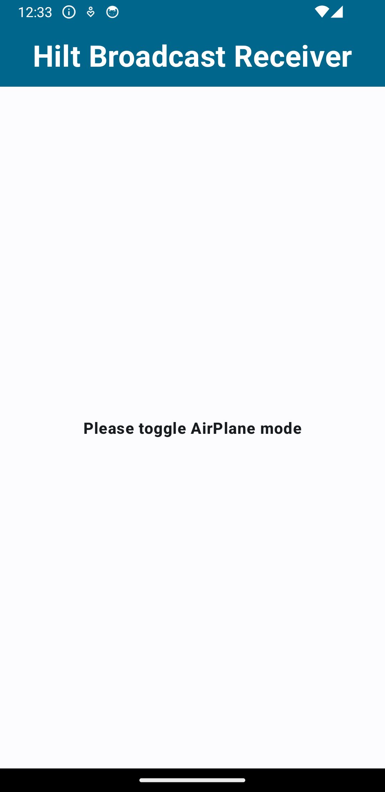
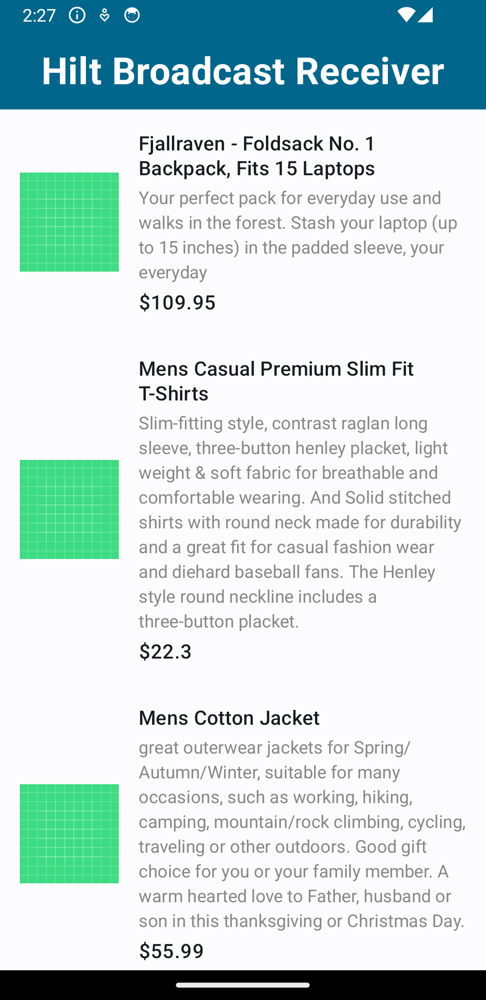

# BroadCastReciver_in_2024

## Description

BroadCastReciver_in_2024 is an Android application containing two projects focusing on Android Broadcast Receivers.

### Project 1: Normal Broadcast Receiver with API Call and Hilt DI

The first project demonstrates a normal broadcast receiver that makes an API call upon receiving an intent and displays the data on the UI. This project showcases the usage of **Hilt Dependency Injection** with Broadcast Receivers, emphasizing best practices in Android development. Common technologies used in this project include **Jetpack Compose**, **Kotlin**, and **Hilt Dependency Injection**.

#### App Screenshots
  

### Project 2: Custom Sender and Receiver Apps

The second project comprises two separate apps: a sender app and a receiver app. It demonstrates sending broadcasts within the app and also to other receivers outside the app. This project illustrates various scenarios of broadcasting and receiving intents in Android applications. Common technologies used in this project include **Jetpack Compose** and **Kotlin**.

## Screenshots

### Sender App

#### Sender App Screenshot
  

### Receiver App

#### Receiver App Screenshot
  

## Table of Contents

- [Installation](#installation)
- [Usage](#usage)
- [Contributing](#contributing)
- [License](#license)

## Installation

1. Clone the repository:
git clone https://github.com/rahulgothwal5/BroadCastReciver_in_2024.git

2. Open the project in Android Studio.

## Usage

Explore the codebase to learn how to implement different scenarios of Android Broadcast Receivers using **Jetpack Compose**, **Kotlin**, and **Hilt Dependency Injection**.

## Contributing

1. Fork the repository.
2. Create a new branch (`git checkout -b feature/your-feature-name`).
3. Make your changes.
4. Commit your changes (`git commit -am 'Add new feature'`).
5. Push to the branch (`git push origin feature/your-feature-name`).
6. Create a new Pull Request.

## License

This project is licensed under the [MIT License](LICENSE).
